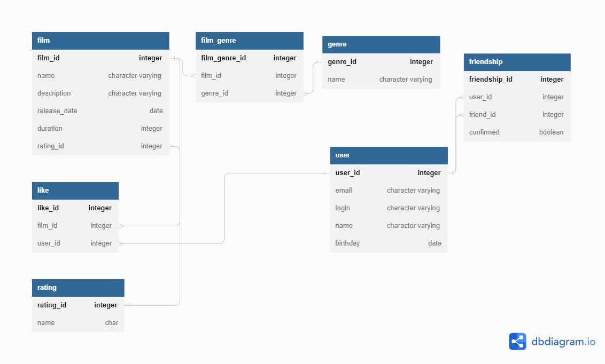

# java-filmorate
## Схема БД: 
## Список таблиц:

1. **film** - таблица фильмов
2. **film_genre** - таблица связи фильма с жанром(тк у фильма может быть несколько жанров)
3. **like** - таблица лайков(тк у фильма может быть несколько лайков)
4. **rating** - таблица рейтингов
5. **friendship** - таблица с id пользователей, которые дружат + статус дружбы
6. **user** - таблица пользователей
7. **genre** - таблица жанров
## Запросы к БД:

### 1. Запрос для всех фильмов с рейтингом:
  `SELECT f.film_id,
   f.name,
   f.description,
   f.release_date,
   f.duration,
   r.name
   FROM film f
   LEFT JOIN rating r ON r.rating_id = f.rating_id`

### 2. Запрос для отображения всех пользователей:
   `SELECT u.user_id,
   u.email,
   u.login,
   u.name,
   u.birthday
   FROM user u`

### 3. Запрос для отображения топ 10 наиболее популярных фильмов
   `SELECT f.name,
   COUNT(l.user_id) likes
   FROM film f
   LEFT JOIN like l ON f.film_id = l.film_id
   GROUP BY name
   ORDER BY likes DESC
   LIMIT 10`

### 4. Запрос для отображения общих друзей с другим пользователем
   `SELECT f.friend_id
   FROM user u
   LEFT JOIN friendship f on u.user_id=f.user_id
   WHERE u.user_id=2 and f.confirmed=TRUE and f.friend_id IN(
        SELECT f.friend_id
        FROM user u
        LEFT JOIN friendship f on u.user_id=f.user_id
        WHERE u.user_id=1 and f.confirmed=TRUES)`

