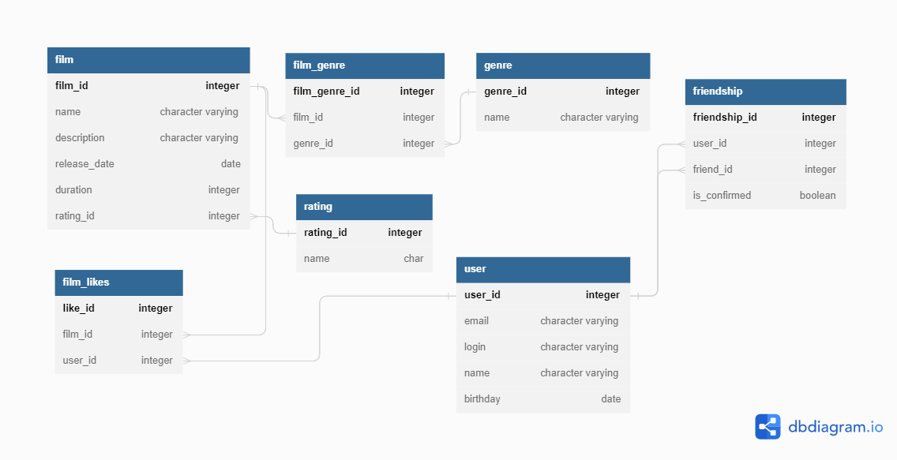

# java-filmorate
## Описание проекта: 
Бэкенд для сервиса, который будет работать с фильмами и оценками пользователей, а также возвращать топ фильмов, рекомендованных к просмотру. 
## Технологический стек:
Java, Spring, PostgreSQL
## Схема БД:<br>
## Список таблиц:

1. **film** - таблица фильмов
2. **film_genre** - таблица связи фильма с жанром(тк у фильма может быть несколько жанров)
3. **film_likes** - таблица лайков(тк у фильма может быть несколько лайков)
4. **rating** - таблица рейтингов
5. **friendship** - таблица с id пользователей, которые дружат + статус дружбы
6. **user** - таблица пользователей
7. **genre** - таблица жанров
## Запросы к БД:

### 1. Запрос для всех фильмов с рейтингом:
  ```
   SELECT f.film_id,
   f.name,
   f.description,
   f.release_date,
   f.duration,
   r.name
   FROM film f
   LEFT JOIN rating r ON r.rating_id = f.rating_id
```
### 2. Запрос для отображения всех пользователей:
   ```
   SELECT u.user_id,
   u.email,
   u.login,
   u.name,
   u.birthday
   FROM user u
   ```

### 3. Запрос для отображения топ 10 наиболее популярных фильмов
   ```
   SELECT f.name,
   COUNT(l.user_id) likes
   FROM film f
   LEFT JOIN film_likes l ON f.film_id = l.film_id
   GROUP BY name
   ORDER BY likes DESC
   LIMIT 10
   ```

### 4. Запрос для отображения общих друзей с другим пользователем
   ```
   SELECT f.friend_id
   FROM friendship f 
   WHERE f.user_id=2 and f.confirmed=TRUE and f.friend_id IN(
     SELECT f.friend_id
     FROM friendship f
     WHERE f.user_id=1 and f.confirmed=TRUE)
```


